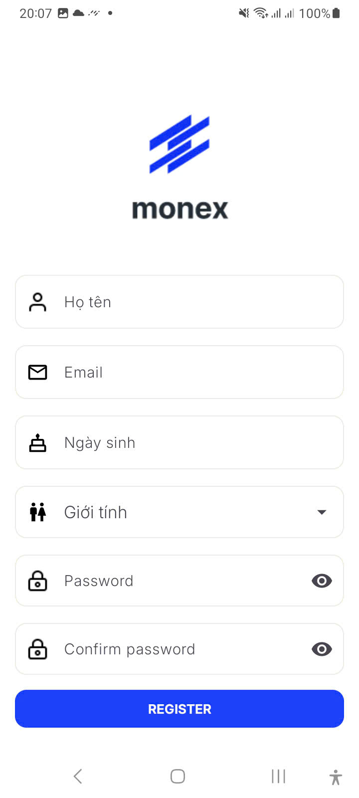
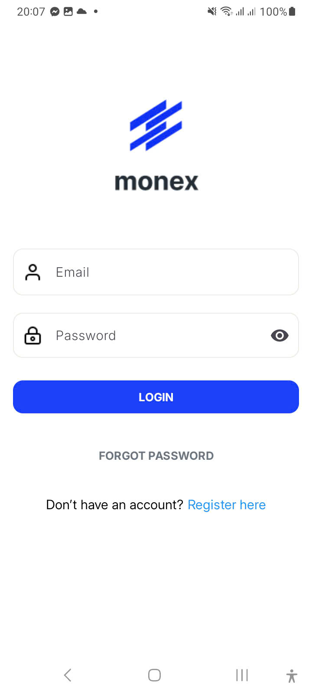
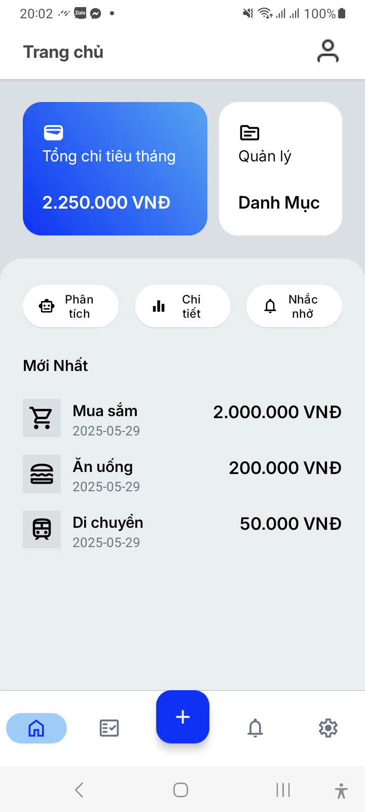
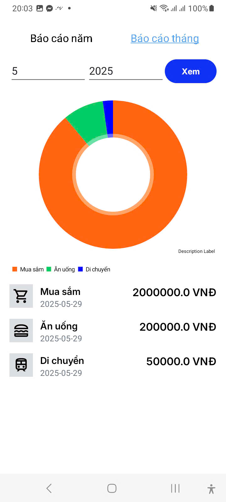
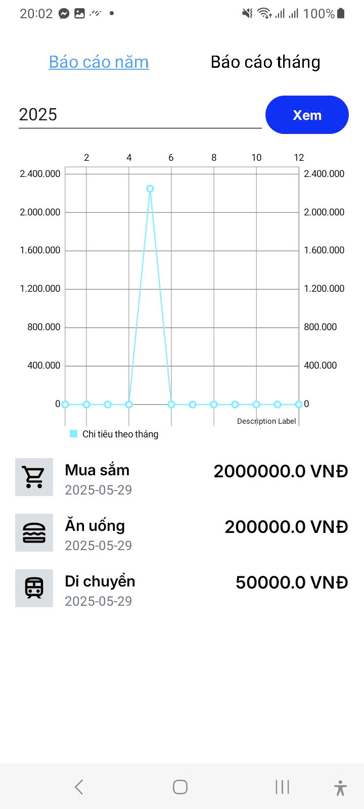
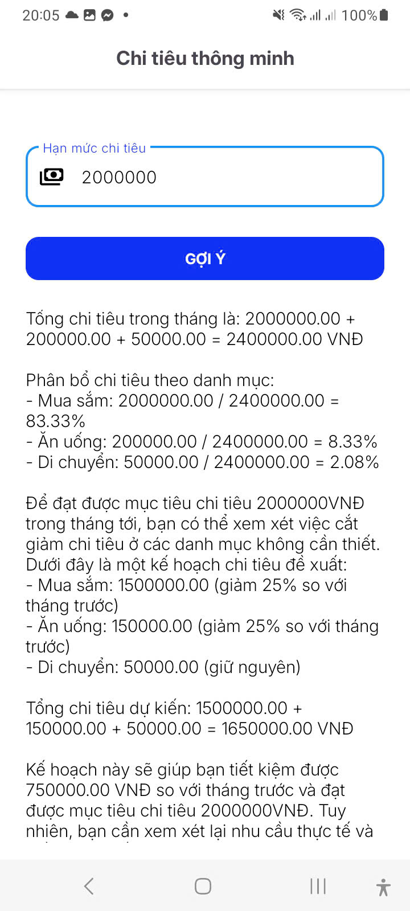

# Expense Management App

## Overview

This Android application helps users manage their expenses by tracking spending, categorizing expenses, and providing insights through analytics. The app features a user-friendly interface for adding, editing, and analyzing expenses.  

Figma design is taken from: [Expense management app ui kit](https://www.figma.com/community/file/1341354400491602502) 

## Features

- **User Authentication**: Secure login and registration system
- **Expense Tracking**: Add, edit, and delete expenses
- **Category Management**: Organize expenses by customizable categories
- **Dashboard**: View recent transactions and monthly spending totals
- **Analytics**: Visualize spending patterns and trends
- **Expense Suggestions**: Get recommendations for budget management by AI
- **Token-based Authentication**: Secure API access with automatic token refresh

## Technical Implementation

### Authentication Flow

The app uses a token-based authentication system:
- Access tokens for API requests
- Refresh tokens to obtain new access tokens when expired

### API Integration

- RESTful API communication using Volley library
- Centralized API service for all network requests
- Proper error handling and user feedback

### Data Storage

- SharedPreferences for user data and token storage
- Efficient data models for expense information

## Setup and Installation

1. Clone the repository
2. Open the project in Android Studio
3. Configure the `BASE_URL` in your `gradle.properties` or `local.properties` file:
   ```
   BASE_URL="https://your-api-endpoint.com"
   ```
4. Build and run the application

## Project Structure

- **activities/**: Contains all activity and fragment classes
- **adapters/**: RecyclerView adapters for lists
- **api/**: API service and network-related classes
- **dtos/**: Data transfer objects for API responses
- **models/**: Data models for the application

## Screenshots
### Sign up

### Sign in

### Dashboard

### Charts



### Suggestion

